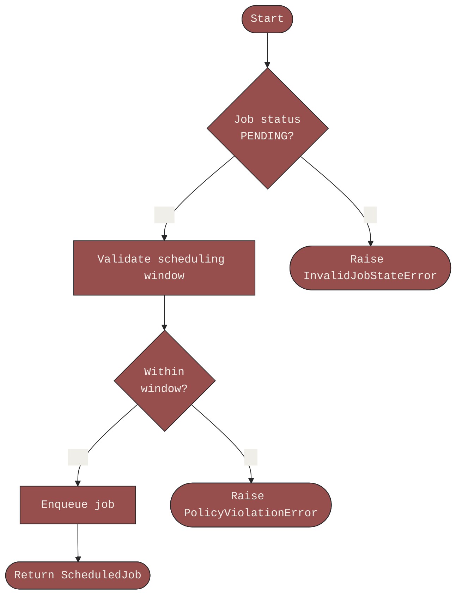
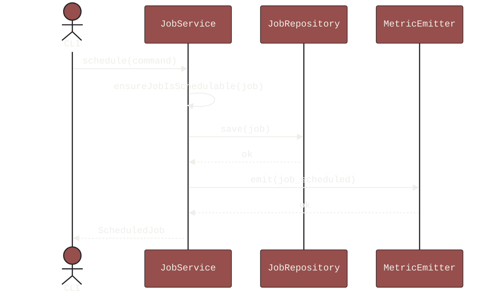
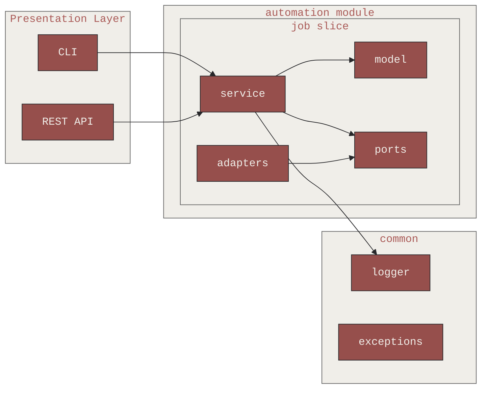
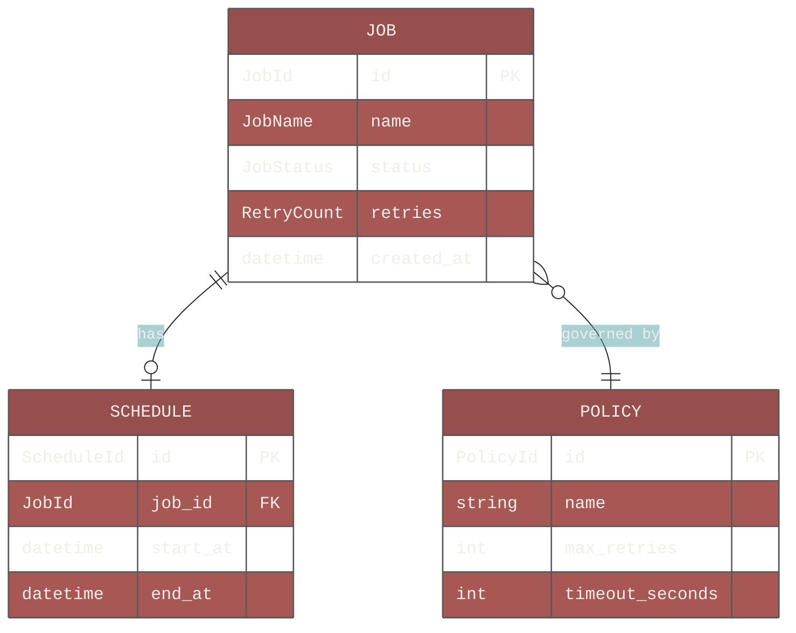
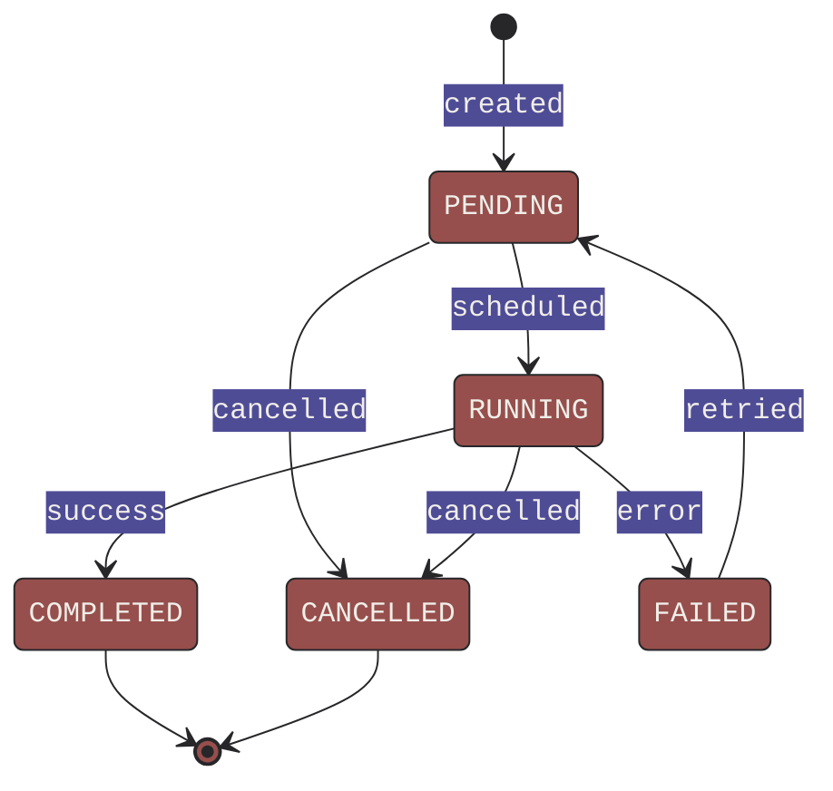

# Diagramming

Diagrams exist to surface problems that prose hides. A sequence diagram that does not
make sense is a design that does not make sense — the diagram found it cheaply.

Always use **Mermaid** for diagrams. It is text-based, version-controllable, and
renders natively in GitHub, VS Code, and most documentation tools.

---

## Brand Colours

Always apply Aidan's brand palette to diagrams.

| Role | Name | Hex |
|---|---|---|
| Primary / accent | Marsala | `#964F4C` |
| Background / light | Cloud Dancer | `#F0EEE9` |
| Text / dark | Black Beauty | `#27272A` |

Apply via Mermaid's `%%{init}%%` directive and `style` / `classDef` declarations.

---

## Flow Diagrams

Use for: process flows, decision trees, guard clause logic, pipeline steps.

---

## Sequence Diagrams

Use for: request/response flows, inter-service communication, use case walkthroughs.

---

## Architecture / System Diagrams

Use for: module relationships, system context, clean architecture layers,
bounded context maps.

---

## Entity Relationship Diagrams

Use for: data models, aggregate boundaries, Pydantic model relationships.

---

## State Machine Diagrams

Use for: entity lifecycle, job status transitions, workflow states.

---

## When to Use Each Diagram Type

| Situation | Diagram type |
|---|---|
| How does this process flow? | Flowchart |
| How do these components talk to each other? | Sequence |
| How is the system structured? | Architecture flowchart |
| What does the data model look like? | ERD |
| What states can this entity be in? | State machine |
| What are the module/bounded context relationships? | Architecture flowchart |

When in doubt, a sequence diagram of the happy path is almost always the most
useful first diagram for any new feature.

---

## Diagramming Rules

- Always apply brand colours via `%%{init}%%` — never use default Mermaid theming
- Use `monospace` as the font family for consistency with a technical context
- Keep diagrams focused — one concern per diagram
- If a diagram is getting large, split it — complexity in a diagram reflects complexity in the design
- Label edges (arrows) with the action or data being passed, not just a direction
- Use subgraphs to group related components — they communicate ownership and boundaries
- Diagrams live in documentation (`docs/`) or inline in ADRs — not scattered in comments
